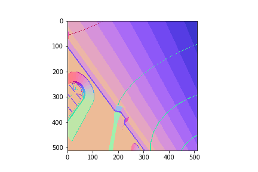
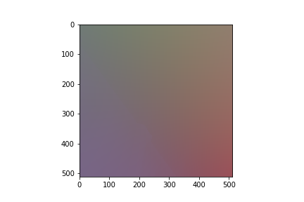
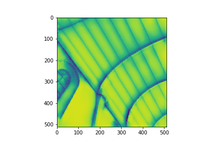

# Deep Shading

## Convolutional Neural Networks for Screen-Space Shading 
Our project is based on Nalbach et al. 2017 <a href="http://deep-shading-datasets.mpi-inf.mpg.de/">paper</a>. In this project,
a set of buffers are provided to a Deep Convolutional Network in order to synthetize differend shading effects (such as Ambient Occlusion,
Depth of Field, Global Illumination and Sub-surface Scattering). The set of buffers depends os the shading effect we want to synthetize.
  
<b>Input Bufers:</b>  

  

<b>Result (Ambient Occlusion):</b>  

## Requirements for the project
0. Python 3.x
1. <a href="https://tensorflow.org">Tensorflow 1.10</a>
2. <a href="https://keras.io">Keras</a>
3. OpenCV 3.4(for loading,resizing images)
4. h5py(for saving trained model)
5. <a href="https://github.com/tvogels/pyexr">pyexr</a>

## Steps to run the repo 
1) Clone the repo 
2) Download the dataset (http://deep-shading-datasets.mpi-inf.mpg.de/) 
3) Install the requirements 
4) Generate the .tfrecord for trainning and validation (Use the DataReader.py) 
5) Run "Shading.py"

## References
[1]  Oliver Nalbach, Elena Arabadzhiyska, Dushyant Mehta, Hans-Peter Seidel, Tobias Ritschel
Deep Shading: Convolutional Neural Networks for Screen-Space Shading
to appear in Proc. EGSR 2017
